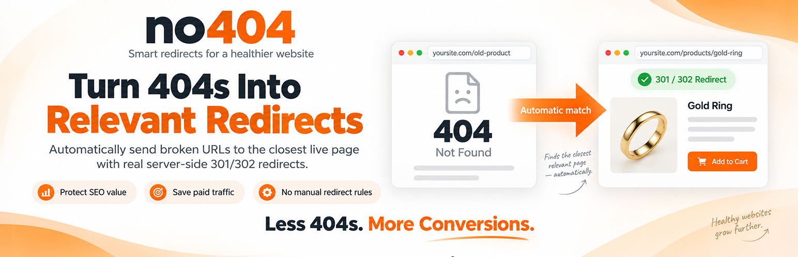
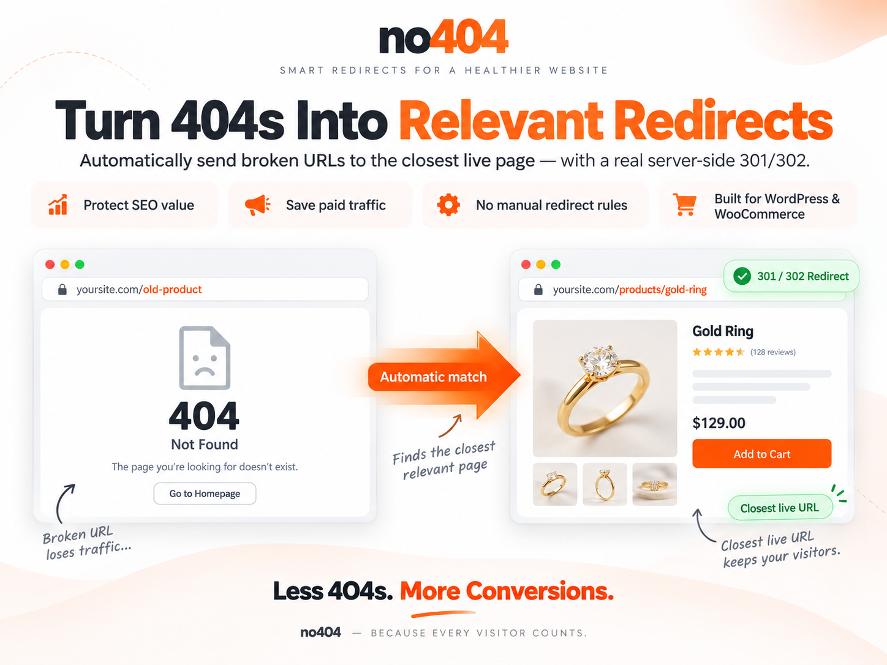
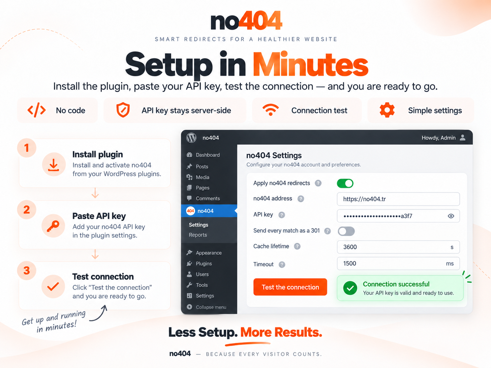
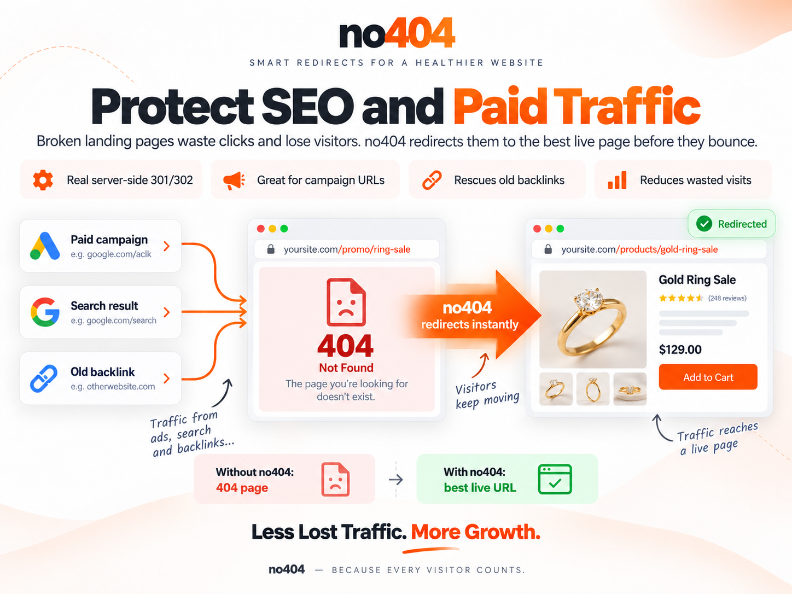
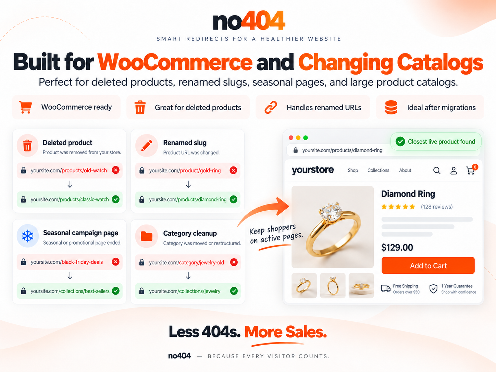
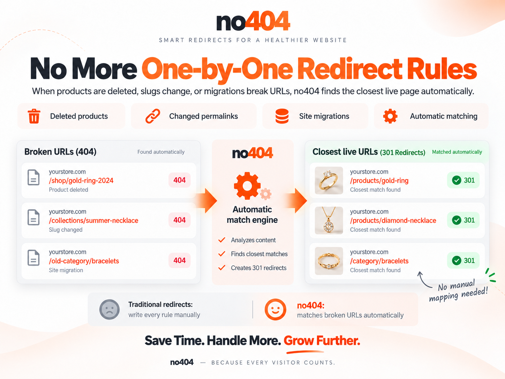

# no404 – Auto 404 Redirect

**Automatically recover the traffic your broken URLs are still getting.**

[](https://wordpress.org/plugins/no404-auto-404-redirect/)
[](https://www.php.net/)
[](https://github.com/RoPi-LLC/no404-wordpress/releases/latest)
[](LICENSE)



no404 detects WordPress 404s and sends the visitor to the closest relevant live page on your site — with a real server-side **301**, and without you maintaining hundreds of redirect rules.

Built especially for **WooCommerce** stores whose catalogue changes often, and for any site that has been migrated or re-permalinked.

**[Try no404 free →](https://no404.tr)** · Free plan: **1,000 lookups per month**, no card.

---

## Before / After

```
Before                              With no404

/products/gold-ring-2024            /products/gold-ring-2024
        │                                   │
        ▼                                   ▼
404 Not Found                       301 Moved Permanently
                                            │
                                            ▼
                                    /products/gold-ring
```

No redirect rule was created by hand. The match came from your own live URL index.



---

## Quick start

1. Install the plugin (WordPress.org search, or upload the release ZIP).
2. Create a free account at [no404.tr](https://no404.tr).
3. Add your site in the dashboard and copy its API key.
4. Paste the key into **Settings → no404** and press **Test the connection**.
5. Done — the next 404 on your site is resolved automatically.

Nothing is added to your theme. [Detailed installation](#installation) is further down.



---

## Use cases

| Situation | What no404 does |
| --- | --- |
| **Google Ads / Meta Ads** landing page removed or renamed | Paid clicks land on a live, relevant page instead of a 404 |
| **WooCommerce** products deleted or out of catalogue | The old product URL resolves to its closest surviving equivalent |
| **SEO backlinks** pointing at old URLs | Visitors from those links reach a real page, and the 301 passes the link on |
| **Site migrations** | The long tail of old URLs is covered without a rule per URL |
| **Changed permalink structure** | Old-format URLs keep working while the index catches up |

### Paid and organic traffic

Clicks from an ad campaign, a search result or an old backlink are the most expensive 404s you can serve — the visit is already paid for by the time the page fails.



### WooCommerce and changing catalogues

Deleted product URLs are the case this plugin was built for. Renamed slugs, ended seasonal pages and restructured categories behave the same way.



---

## Why it is different from a redirect table

Most redirect plugins ask you to fix this by hand: one rule per broken URL. That does not scale past a few dozen. **no404 works the other way around** — it keeps a synchronised index of the URLs your site actually has, and when a request 404s it finds the closest match automatically.

| | Traditional redirects | no404 |
| --- | --- | --- |
| Manual rules | Required, one per URL | Not required |
| Deleted products | Fixed individually | Matched automatically |
| Hundreds of old URLs | Time-consuming | Handled by the index |
| Existing redirect plugins | — | Runs after them, alongside them |
| Server-side redirect | Yes | Yes |



- **WordPress.org:** [wordpress.org/plugins/no404-auto-404-redirect](https://wordpress.org/plugins/no404-auto-404-redirect/)
- **Source & releases:** [github.com/RoPi-LLC/no404-wordpress](https://github.com/RoPi-LLC/no404-wordpress) · [latest release](https://github.com/RoPi-LLC/no404-wordpress/releases/latest)
- **Service & account:** [no404.tr](https://no404.tr)

---

## Why a plugin, and not a JavaScript snippet

no404 can also be wired up with a snippet in your 404 template. That works everywhere, but it cannot do the one thing that actually matters:

| | JS snippet | This plugin |
| --- | --- | --- |
| Redirect type | `location.replace` — the HTTP status **stays 404** | A real **301 / 302** |
| SEO | Google still sees a 404 | The 301 passes the old URL's signals on to the target |
| Crawlers | Bots that do not run JS are never redirected | Redirected |
| Setup | Paste code into your theme | Install, paste your key |
| API key | **Visible** in the page source | Server-side only |

The reason this plugin exists is the **301**. If it were not done server-side, there would be no point writing it.

---

## Requirements

| | |
| --- | --- |
| WordPress | 6.0 or newer |
| PHP | 7.4 or newer |
| Account | A free [no404](https://no404.tr) account and an API key |

The matching engine runs as a hosted service, so an account is required. The free plan covers 1,000 lookups per month. See [What is sent to the service](#what-is-sent-to-the-service) for exactly what leaves your server.

## Installation

**From WordPress.org**
Plugins → Add New → search for *no404*, then Install and Activate.

**From the ZIP**
1. Download the latest release ZIP.
2. Plugins → Add New → **Upload Plugin** → choose the file → Install → Activate.

**Then, in either case**
1. Go to **Settings → no404**.
2. Paste the API key from the site settings page of your no404 dashboard.
3. Leave *Apply no404 redirects on pages that are not found* ticked.
4. Press **Test the connection** to confirm it works.

That is the whole setup. There is nothing to add to your theme.

---

## How it works

```
Visitor requests /old-product
        │
        ▼
WordPress decides the request is a 404
        │
        ▼
template_redirect (priority 9999 — after Yoast, Rank Math, Redirection)
        │
        ├─ Static file or admin path?  ──────────────► do nothing
        ├─ Not a GET/HEAD request?     ──────────────► do nothing
        ├─ Already in the local cache? ──────────────► use the cached answer
        │
        ▼
Ask no404: GET /api/v1/resolve/{key}?path=/old-product
        │  (1.5 s timeout, failures are swallowed)
        ▼
Validate the target: same-site host, no loop, no control characters
        │
        ▼
wp_safe_redirect( $target, 301|302 )  +  X-Redirect-By: no404
```

If anything goes wrong at any step — the service is slow, down, or returns something unexpected — the plugin does nothing and WordPress renders your own 404 page as usual.

### 301 or 302?

Not every match deserves a permanent redirect. 301s may be cached aggressively by browsers and search engines, so an incorrect permanent redirect can be hard to reverse quickly.

| Match source | Score | Status |
| --- | --- | --- |
| `REDIRECT` — a rule you defined by hand | — | **301** |
| `CATALOG` — matched against your URL index | ≥ 0.5 | **301** |
| `CATALOG` | < 0.5 | 302 |
| `FALLBACK` — a guess | — | 302 |

There is a *Send every match as a 301* option in the settings. It is **off by default**, and you should only turn it on if you are confident your catalogue is complete.

### Your site never waits

The lookup has a **1.5 second timeout** and every failure is swallowed. On top of that there is a **circuit breaker**: after a transport error or a 5xx the plugin stops asking for 60 seconds; after a 429 (quota) or a 403/404 (configuration) it stops for 300 seconds. So an outage on our side never puts a timeout cost on every 404 your site serves.

### Quota friendly by design

Plan limits are based on monthly event count, so this is your bill.

- Results are cached locally for **one hour**, including *no match found* — a bot hammering the same dead URL 200 times a day costs you one lookup, not 200.
- **Query strings are stripped.** Keeping `?utm_source=…` would turn one page into dozens of separate cache entries and dozens of billed events.
- Static files (`.css`, `.js`, `.png` …) and admin paths (`/wp-admin`, `/wp-json` …) are **never** sent to the service.

---

## Settings

**Settings → no404**

| Setting | Default | What it does |
| --- | --- | --- |
| Apply no404 redirects | On | The master switch. |
| no404 address | `https://www.no404.tr` | Only change this if you host no404 yourself. |
| API key | — | Stored server-side; shown masked after saving. |
| Send every match as a 301 | Off | Turns speculative 302s into permanent 301s. |
| Cache lifetime | 3600 s | Min 60, max 604800 (7 days). Shorter means more quota used. |
| Timeout | 1500 ms | After this the request is dropped and your 404 page is shown. |
| Excluded paths | — | One path prefix per line; never sent to the service. |

**Connection test.** The settings page sends a real request using your saved settings and tells you precisely what is wrong: an invalid key (404), an inactive subscription (403), and an exhausted quota (429) each produce their own message rather than a generic failure.

### Works alongside your SEO plugin

The redirect hook runs at `template_redirect` priority **9999**, so Yoast SEO, Rank Math and Redirection get to apply their own rules first. If one of them handles the URL, no404 is never consulted. **no404 is the last resort, not the first.**

### Multisite

Each site keeps its own key, settings and cache. The client is rebuilt after `switch_to_blog()`, and uninstalling cleans up every site in the network.

---

## Languages

The plugin is **written in English** and ships with seven translations. It follows your WordPress language setting — there is nothing to configure.

| Locale | Language | | Locale | Language |
| --- | --- | --- | --- | --- |
| `tr_TR` | Türkçe | | `ru_RU` | Русский |
| `de_DE` | Deutsch | | `hi_IN` | हिन्दी |
| `fr_FR` | Français | | `ar` | العربية *(right-to-left)* |
| `es_ES` | Español | | | |

If your language is not on the list, the plugin falls back to English rather than showing untranslated placeholders. Translations for every string are complete — the build refuses to produce a package with a missing or empty entry.

Want to add your language? See [CONTRIBUTING.md](CONTRIBUTING.md#translations).

---

## Privacy and security

### What is sent to the service

A request is made **only** when a visitor hits a 404 page, and only when the answer is not already cached.

**Sent:** the path that 404'd (query string stripped, e.g. `/old-product`) · the `Referer` header when the browser supplies one · your site's home URL and the plugin version, in the User-Agent · your API key.

**Not sent:** the visitor's IP address, their user agent, cookies, session data, form contents, or any other personal data.

The service is operated by no404 — [Terms](https://no404.tr/terms) · [Privacy Policy](https://no404.tr/privacy).

### Security measures

- **Your API key is never printed to the page.** The settings field is a password input, and after saving only a mask (`••••••••` + last 4 characters) is shown. Submitting the field empty or masked keeps the stored key.
- **Open-redirect protection.** The target host must be on the allow-list built from `home_url` and `site_url` (including www / non-www), and it is additionally run through WordPress's own `wp_validate_redirect()`. `//evil.com`, `javascript:` and `data:` targets are rejected.
- **Header injection.** Targets containing control characters are rejected.
- **Loop protection.** A target that normalises to the current path is not followed. There are no chains — one redirect per request, then `exit`.

---

## Hooks

| Filter | Signature |
| --- | --- |
| `no404_skip_request` | `( bool $skip, string $path )` — skip this request entirely. |
| `no404_redirect_target` | `( string $target, int $status, array $result, string $path )` |
| `no404_redirect_status` | `( int $status, array $result, string $path )` |
| `no404_allowed_hosts` | `( string[] $hosts )` — the open-redirect allow-list. |
| `no404_client_config` | `( array $config )` — the core client configuration. |

Example — never redirect anything under `/shop/archive/`:

```php
add_filter( 'no404_skip_request', function ( $skip, $path ) {
	return $skip || 0 === strpos( $path, '/shop/archive/' );
}, 10, 2 );
```

---

## Frequently asked

**Does every 404 use up part of my quota?**
No. Cached paths, static files, admin paths and non-GET requests are never sent.

**What happens if the no404 service goes down?**
Nothing visible. The lookup fails silently, your own 404 page is shown, and the circuit breaker stops further attempts for a while.

**It redirected someone to the wrong page. How do I fix that?**
Add a manual rule in your no404 dashboard. Manual rules always win over automatic matches, and always produce a 301.

**How can I tell a redirect came from this plugin?**
Every redirect carries an `X-Redirect-By: no404` header.

**Does it slow down my site?**
Normal pages are untouched — the plugin only runs after WordPress has already decided the request is a 404.

---

## Development

Architecture, the behaviour contract, tests, the translation workflow and packaging are documented in **[CONTRIBUTING.md](CONTRIBUTING.md)**.

```bash
php tests/test-core.php        # core behaviour, no WordPress needed
php tests/test-wordpress.php   # integration against stubbed WordPress
bash bin/build.sh              # → dist/no404-auto-404-redirect-<version>.zip
```

## License

[GPL-2.0-or-later](LICENSE).
